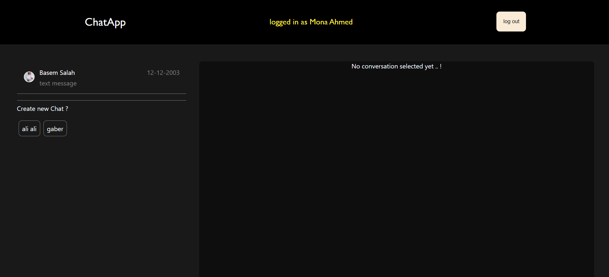
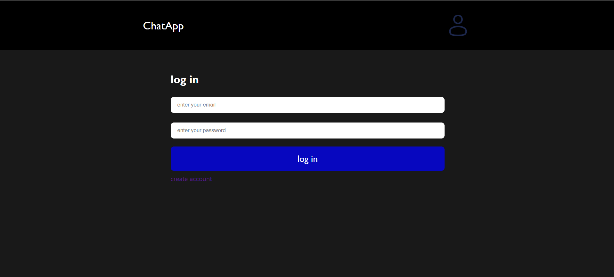
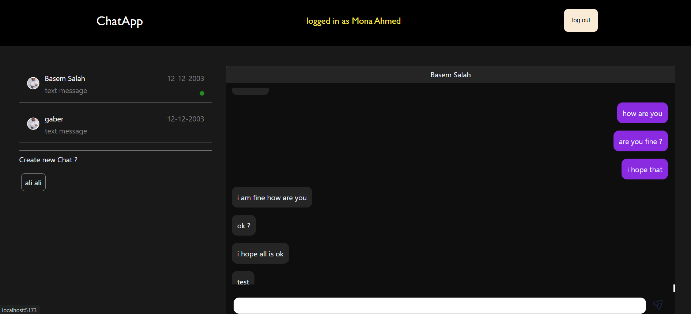

# Chat App
A real-time chat application built using a client-server architecture. This project is divided into three main parts:

- **Backend**: Handles the server-side logic and API endpoints.
- **Client**: The front-end for users to interact with the chat interface.
- **Socket**: Manages real-time messaging using WebSocket technology.

## Table of Contents
- [Features](#features)
- [Tech Stack](#tech-stack)
- [Project Structure](#project-structure)

## Features
- Real-time messaging with WebSocket
- User authentication (sign up, log in)
- Create Chat 
- Persistent chat history
- Responsive user interface
- Show online users 

## Tech Stack

### Backend
- **Node.js**: JavaScript runtime for building server-side applications
- **Express**: Web framework for Node.js
- **MongoDB**: NoSQL database for storing user and message data
- **Socket.io**: Real-time, bidirectional communication for chat functionality
- **JWT**: For user authentication and authorization

### Client
- **React**: JavaScript library for building the user interface

## User Authentication Flow

Users can access the chat application by logging in. If a user does not have an account, they can easily sign up. The flow is as follows:

1. **Login**: 
   - Users enter their credentials (email and password) to log in.
   - Upon successful login, they gain access to the chat interface and can start chatting.

2. **Sign Up**: 
   - If the user does not have an account, they can click on the "Sign Up" button.
   - They will be prompted to enter their details, including their name, email, and password.
   - After successfully signing up, the user can log in with their new credentials.

This process ensures that users have secure access to their chats and can easily create an account if they are new to the application.

## Chat Functionality

Once logged in, users can create new chats with other users and start chatting. The process is as follows:

1. **Create a New Chat**: 
   - Users can select one or more contacts from their friends list to initiate a new chat.
   - After selecting contacts, they can create a new chat room.

2. **Start Chatting**: 
   - Once the chat room is created, users can send messages in real-time to other participants.
   - Users can also see the message history for ongoing chats.

This functionality allows users to easily communicate with their friends and maintain conversations within the application.

